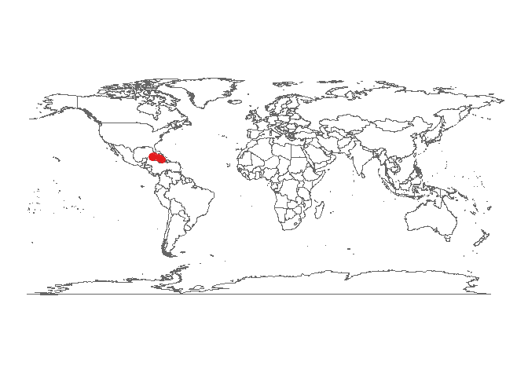
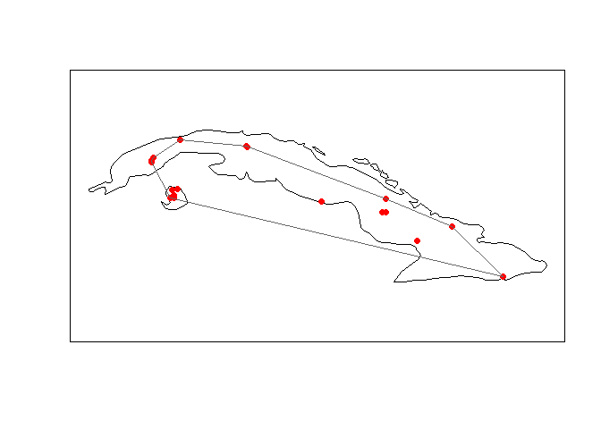
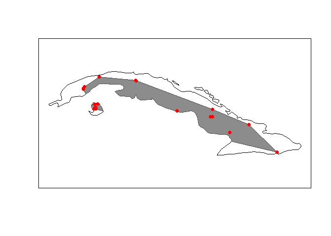

Species range maps in R: test
================
Marlon E. Cobos
March 10, 2018

Required packages
-----------------

The following packages are required to perform all the analyses.

``` r
#Load packages
if(!require(rgbif)){
  install.packages("rgbif")
  library(rgbif)
}
```

    ## Loading required package: rgbif

``` r
if(!require(sp)){
  install.packages("sp")
  library(sp)
}
```

    ## Loading required package: sp

``` r
if(!require(maps)){
  install.packages("maps")
  library(maps)
}
```

    ## Loading required package: maps

``` r
if(!require(maptools)){
  install.packages("maptools")
  library(maptools)
}
```

    ## Loading required package: maptools

    ## Checking rgeos availability: TRUE

``` r
if(!require(rgeos)){
  install.packages("rgeos")
  library(rgeos)
}
```

    ## Loading required package: rgeos

    ## rgeos version: 0.3-26, (SVN revision 560)
    ##  GEOS runtime version: 3.6.1-CAPI-1.10.1 r0 
    ##  Linking to sp version: 1.2-7 
    ##  Polygon checking: TRUE

Easy test
---------

**Download occurrences data from GBIF for a species and display them on a map.** Search for the species *Peltophryne empusa*.

``` r
pe <- name_lookup(query = "Peltophryne empusa", rank="species", return = "data") #data frame with information of the species

pek <- pe$key #vector of the keys to be used in following process
pek
```

    ## [1]   2422480 102075705 119233513 110871521

Count amount of georeferenced species records.

``` r
tot_rec_pe <- c(occ_count(taxonKey = pek[1], georeferenced = TRUE), #total number of records for this species using all keys
                occ_count(taxonKey = pek[2], georeferenced = TRUE),
                occ_count(taxonKey = pek[3], georeferenced = TRUE),
                occ_count(taxonKey = pek[3], georeferenced = TRUE))
tot_rec_pe #checking number of records for each key. Only the first one is useful
```

    ## [1] 146   0   0   0

Download data for this species.

``` r
pe_dat <- occ_search(taxonKey = pek[1], return = "data") #getting the data from GBIF

pe_datg <- pe_dat[!is.na(pe_dat$decimalLatitude) & !is.na(pe_dat$decimalLongitude),] #keeping only georeferenced records
```

Erase duplicated records and check records in a map.

``` r
pe_datg <- as.data.frame(pe_datg) #converting rgbif data to dataframe

pe_datgu <- pe_datg[row.names(unique(pe_datg[,3:4])),] #keeping only unique records

gbifmap(input = pe_datgu) #records in map
```

    ## Rendering map...plotting 23 points



``` r
gbifmap(input = pe_datgu, region = "Cuba") #only mapping the region in wich the species actually is
```

    ## Rendering map...plotting 23 points


Keep only records in land and plot results.

``` r
crs <- CRS("+proj=longlat +datum=WGS84") #projection

pe_points <- SpatialPointsDataFrame(coords = pe_datgu[,4:3], data = pe_datgu, #converting dataframe in spatialpointdataframe 
                                    proj4string = crs)

cu_map <- map(database = "world", regions = "Cuba", fill = TRUE, plot = FALSE) #map of Cuba

cu_po <- sapply(strsplit(cu_map$names, ":"), function(x) x[1]) #preparing data to create polygon
cu_poly <- map2SpatialPolygons(cu_map, IDs = cu_po, proj4string = crs) #map to polygon

pe_in <- pe_points[!is.na(over(pe_points, cu_poly)),] #getting only records in land

plot(cu_poly) #area of interest
box()
points(pe_in, col = "red") #adding records in map
```


<br>

Medium test
-----------

**Draw a convex hull polygon around the points in the earlier test.** Create a convex hull polygon based on the species with the broad distribution

``` r
ch_spdf <- function(x, crs, lon, lat){ #funtion to create convex hull polygon
  df <- as.data.frame(x[, c(lon, lat)])[,1:2] #spatial point dataframe to data frame keeping only coordinates
  ch <- chull(df) #convex hull from points
  coords <- df[c(ch, ch[1]),] #defining coordinates
  ch_Pp <- SpatialPolygons(list(Polygons(list(Polygon(coords)), ID = 1))) #transformation of C_hull into a polygon
}

ch_pe <- ch_spdf(x = pe_in, crs = crs, lon = "decimalLongitude", lat = "decimalLatitude") #creating convexhull polygon
proj4string(ch_pe) <- CRS("+proj=longlat +datum=WGS84") #defining projection
```

Plot area, records, and convexhull polygon.

``` r
plot(cu_poly) #region of interest
box()
points(pe_in, pch = 19, col = "red") #records
plot(ch_pe, border = "gray40", add = T)
```



<br>

Hard test
---------

**Clip the polygon you generated in medium test to world map (Keep only part of the polygon which is on land).** World map to spatial polygon.

``` r
w_map <- map(database = "world", fill = TRUE, plot = FALSE) #map of the world

w_po <- sapply(strsplit(w_map$names, ":"), function(x) x[1]) #preparing data to create polygon
w_poly <- map2SpatialPolygons(w_map, IDs = w_po, proj4string = crs) #map to polygon
```

Clip world with convex hull polygon and plot results.

``` r
clip_area <- gIntersection(w_poly, ch_pe, byid = TRUE, drop_lower_td = TRUE)

##Ploting
plot(cu_poly) #region of interest
plot(clip_area, col = "gray55", add = TRUE, border = "gray30") #area of interest clipped with convexhull
box()
points(pe_in, pch = 19, col = "red") #records
```


